# 실전프로젝트02: 오타 수정 by “오탁수정”

- **팀원**: 오정탁, 김아람, 박재영, 이서율, 황호성
- **기간**: 2025년 10월 24일(금) ~ 11월 03일(월)
- **발표일**: 2025년 11월 03일 9:30 ~

---

## 1. 프로젝트 개요 및 목표 (Introduction)

### 1-1. 프로젝트 개요

- 텍스트 내의 문법적 오류를 자동으로 교정하는 인공지능 모델을 구축
- 적절한 사전 학습(\*_Pretrained_) 언어 모델을 탐색하고, 데이터 특성에 맞게 Fine-tunning 전략을 수립 및 적용하여 모델의 문법 교정 성능을 향상

### 1-2. 핵심 목표

1. **Pretrained 모델 탐색 및 선정**
   - GEC에 적합한 Transformer 기반 모델 비교 및 선정
2. **Fine-tunning 전략 수립 및 실험**
   - 데이터 증강(Augmentation)을 통한 성능 개선
3. **데이터 기반 EDA**
   - 문장 길이, 오류 빈도, 수정 비율 등 텍스트 특성 분석
   - 학습/평가 데이터 간 분포 차이 파악..?
4. **성능 평가 및 개선**
   - BEA 리더 보드 제출을 통한 객관적 성능 검증
5. **프로젝트 산출물 제작**
   - 코드, 결과, 분석 과정을 Github에 정리
   - 작동 확인 가능한 텍스트 입력 → 출력 시연 데모 제작

---

## 2. 데이터 분석 및 전처리 (EDA & Preprocessing)

### 2-1. C4 (학습)

#### 2-1-1. Sentence-Level Structural Insights

|                                |                                |
| ------------------------------ | ------------------------------ |
| 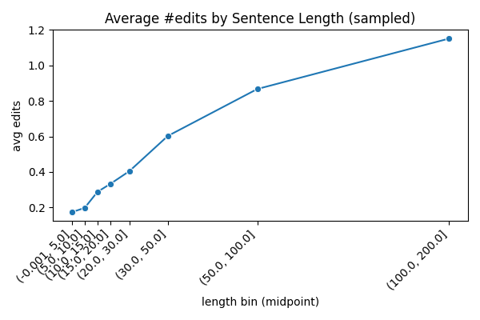 | 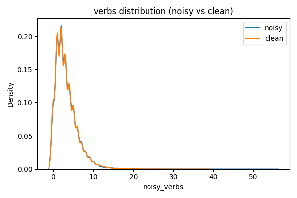 |
| 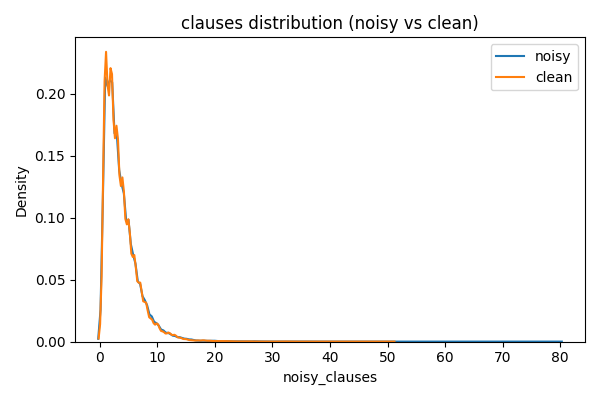 | 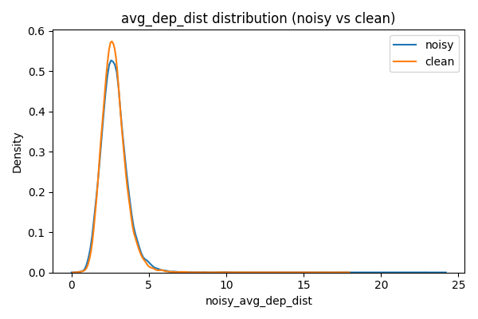 |

<br />

| 관찰           | 모델링 인사이트                                        |
| -------------- | ------------------------------------------------------ |
| 문장 길이 짧음 | context window ≤128 토큰으로 충분                      |
| 의존 거리 감소 | Syntax-aware embedding 효과적                          |
| 구조 단순화    | 구조 단순화 정규화(simplification regularization) 가능 |

#### 2-1-2. Edit Behavior Analysis

|                                |                                |
| ------------------------------ | ------------------------------ |
| 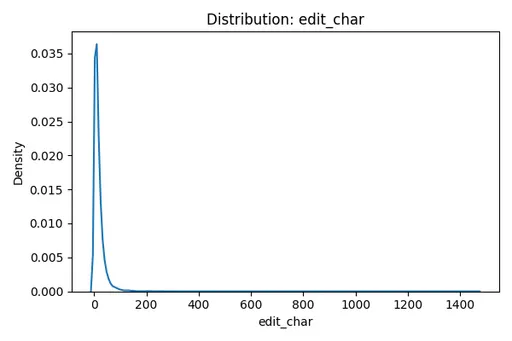 | 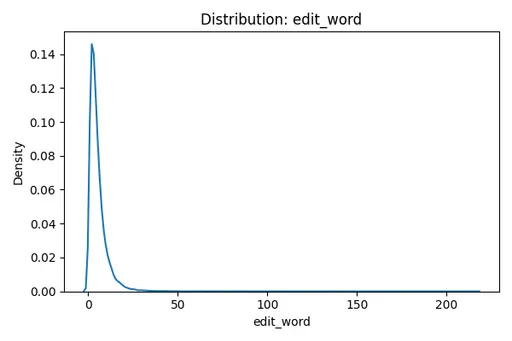 |
| 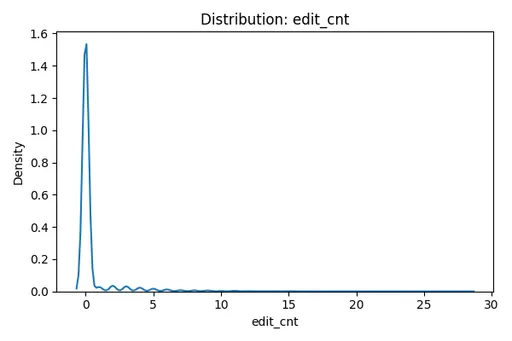 | 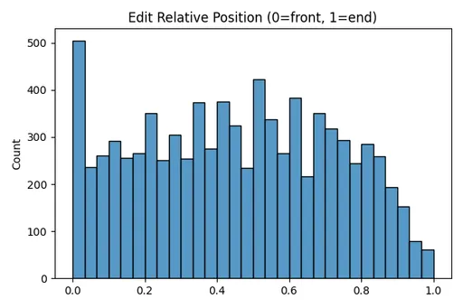 |
| 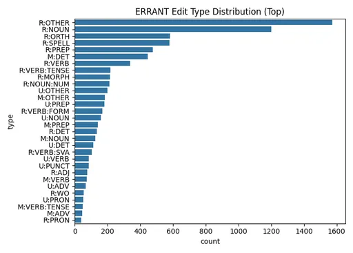 |                                |

<br />

| R   | 잘못된 토큰을 다른 걸로 교체 |
| --- | ---------------------------- |
| M   | 누락된 토큰 삽입             |
| U   | 불필요한 토큰 삭제           |

<br />

| 관찰             | 모델링 인사이트                                                          | 수치                        |
| ---------------- | ------------------------------------------------------------------------ | --------------------------- |
| 수정량 적음      | Copy-heavy seq2seq(GECToR/PIE) 이상적                                    | 횟수 : 2~3회, 비율 10% 미만 |
| 중간부 수정 집중 | Attention bias를 중앙 구간에 부여(position embedding에 중심 가중치 적용) | 0.2~0.6                     |
| Replace 중심     | Substitution-oriented decoder 설계                                       | 70%                         |
| 철자 비중 낮음   | Subword 기반 토크나이저 적합                                             | 13.8%                       |

#### 2-1-3. Error Co-occurrence Network

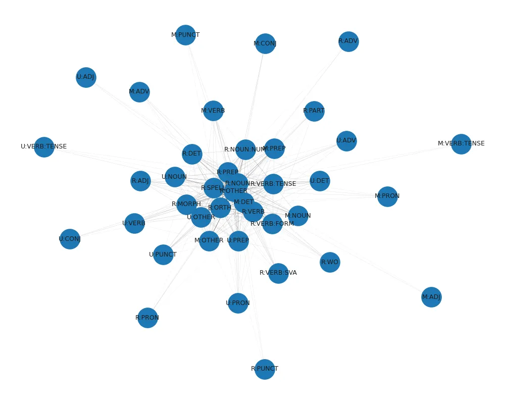

| 관찰                         | 모델링 인사이트                                    |
| ---------------------------- | -------------------------------------------------- |
| 오류 유형 간 의존            | 다중 레이블 기반 예측(Multi-label Edit Prediction) |
| NOUN–VERB–PREP–DET 연결 강함 | Relation-aware attention 유리                      |
| 오류 쌍 자주 등장            | Co-occurrence 기반 데이터 증강 유효                |

#### 2-1-4. Syntactic Simplification

|                                 |                                 |
| ------------------------------- | ------------------------------- |
| 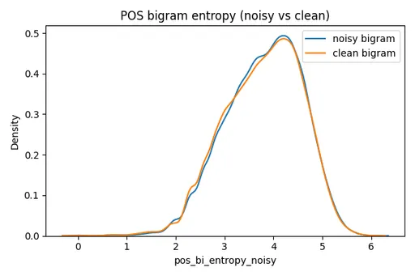 | 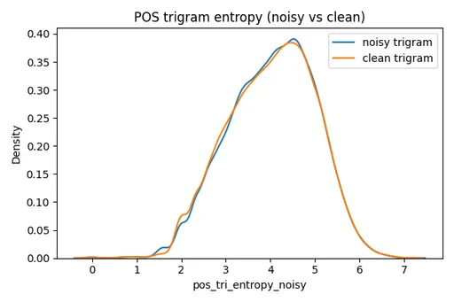 |

<br />

| 관찰              | 모델링 인사이트                                                           | 수치    |
| ----------------- | ------------------------------------------------------------------------- | ------- |
| 의존 깊이 감소    | 구조 단순화 유도 Loss 설계 가능                                           | 10~15%  |
| POS 엔트로피 감소 | Entropy regularization 적용                                               | 0.3~0.5 |
| 구조 안정화       | Over-generation 방지 기법 필요 (필요 이상 생성, 과교정 방지 패널티 부여?) |         |

#### 2-1-5. POS Transition Patterns

|                                 |                                 |
| ------------------------------- | ------------------------------- |
| 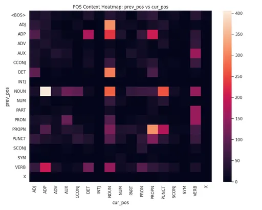 | 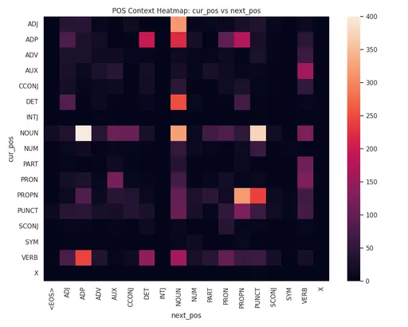 |

<br />

- 이전 품사 → 현재품사
- 현재 품사 → 이전 품사

| 관찰                             | 모델링 인사이트                                      |
| -------------------------------- | ---------------------------------------------------- |
| 안정된 품사 전이(입력 특징 강화) | POS Embedding + Position Encoding 결합 유효          |
| 양방향 일관성                    | BERT/T5 기반 양방향 attention 유리                   |
| 학습 커리큘럼                    | 품사 안정성 높은 문장 → 낮은 문장 순으로 단계적 학습 |

#### 2-1-6. Sentence Complexity Features

**지표 변화 (교정 전→후)**

| **Feature**       | **변화** | **의미**         |
| ----------------- | -------- | ---------------- |
| avg_dep_dist      | ↓        | 문장 구조 단순화 |
| pos_entropy_tri   | ↓        | 품사 다양성 감소 |
| edit_ratio_tokens | ≈0.1     | 소규모 수정      |
| clause_count      | ↓        | 절 개수 감소     |
| verb_ratio        | ≈ 동일   | 의미 보존        |

#### 2-1-7. Feature Correlation (Spearman)

**상관 분석 결과**

| **Feature Pair**             | **ρ** | **해석**                    |
| ---------------------------- | ----- | --------------------------- |
| pos_entropy_tri ↔ edit_ratio | +0.62 | POS 다양성↑ → 교정량↑       |
| avg_dep_dist ↔ edit_ratio    | +0.45 | 문법 복잡도↑ → 오류 가능성↑ |

#### [C4_EDA 결과](https://www.notion.so/C4_EDA-29965bf8ceca8041bd06c1bec159dc41)

### 2-2. BEA19 (평가)

| text 단어 수                      | edit 개수                         |
| --------------------------------- | --------------------------------- |
| 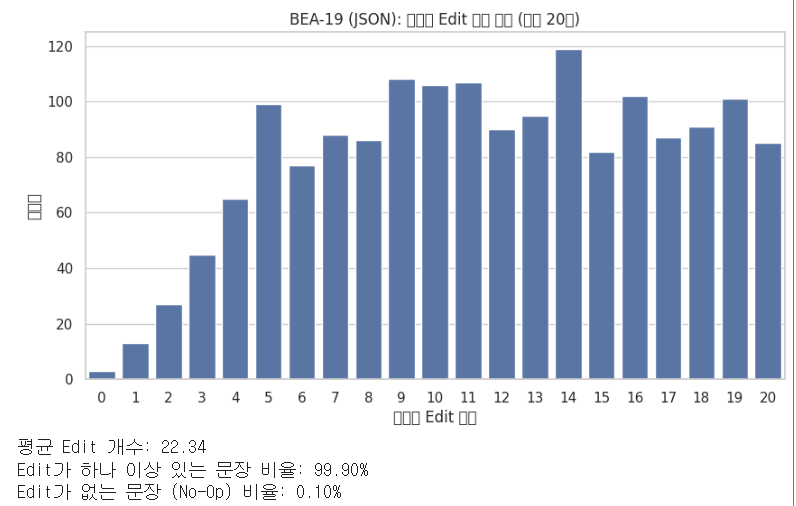 | 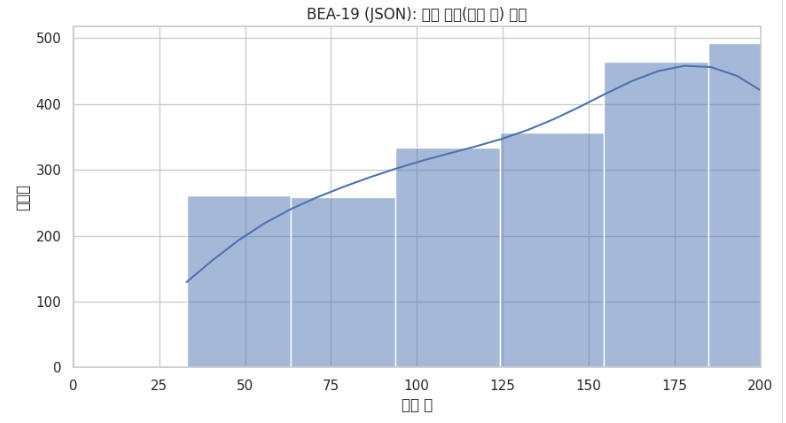 |

<br />

| len_words | **count** | **mean**  | **std**   | **min** | **25%** | **50%** | **75%** | **max** |
| --------- | --------- | --------- | --------- | ------- | ------- | ------- | ------- | ------- |
| **BEA**   | 2856.0    | 22.658964 | 13.244644 | 2.0     | 14.0    | 20.0    | 28.0    | 157.0   |

<br />

| len_chars | **count** | **mean**   | **std**   | **min** | **25%** | **50%** | **75%** | **max** |
| --------- | --------- | ---------- | --------- | ------- | ------- | ------- | ------- | ------- |
| BEA       | 2856.0    | 114.562325 | 69.170134 | 8.0     | 69.0    | 102.0   | 143.0   | 790.0   |

<br />

| **C4_rows**       | **BEA_rows**       | **C4_avg_words**    | **BEA_avg_words** |
| ----------------- | ------------------ | ------------------- | ----------------- |
| 30000             | 2854               | 21.9422             | 22.660477         |
| **BEA_edit_mean** | **C4_POS_entropy** | **BEA_POS_entropy** | **C4_edit_mean**  |
| 0.088296          | 4.286405           | 4.335439            | 0.147281          |

#### [EDA 결과](https://www.notion.so/EDA-296e51228f4b808cb2aac129f2ce93f7)

---

## 3. 모델 구현

### 3-0. 멤버 별 모델 구현

### 3-1. 데이터 준비

- [오류가 섞인 문장, 정답 문장]


- GEC_utill 사용 → [토큰, 태그]

```jsx
config
[토큰]SEPL|||SEPR[태그]

precessed.dry :
$STARTSEPL|||SEPR$KEEP MuchSEPL|||SEPR$DELETE manySEPL|||SEPR$TRANSFORM_CASE_CAPITAL brandsSEPL|||SEPR$KEEP andSEPL|||SEPR$KEEP sellersSEPL|||SEPR$KEEP stillSEPL|||SEPR$KEEP inSEPL|||SEPR$KEEP theSEPL|||SEPR$KEEP market.SEPL|||SEPR$KEEP
$STARTSEPL|||SEPR$KEEP FairySEPL|||SEPR$KEEP OrSEPL|||SEPR$KEEP Not,SEPL|||SEPR$KEEP I'mSEPL|||SEPR$KEEP theSEPL|||SEPR$KEEP Godmother:SEPL|||SEPR$KEEP noSEPL|||SEPR$REPLACE_Not justSEPL|||SEPR$APPEND_a look,SEPL|||SEPR$KEEP butSEPL|||SEPR$KEEP mySEPL|||SEPR$KEEP outfitSEPL|||SEPR$KEEP forSEPL|||SEPR$KEEP takingSEPL|||SEPR$APPEND_on theSEPL|||SEPR$KEEP partSEPL|||SEPR$REPLACE_role asSEPL|||SEPR$KEEP godmother.SEPL|||SEPR$KEEP
```

```python
TOKENS : ['he', 'go', 'to', 'school']
TAGS: ['$KEEP', '$TRANSFORM_VERB_VB_VBD', '$KEEP', '$KEEP']
```

```xml
[Line 1]
  Much                  <--  $DELETE
  many                  <--  $TRANSFORM_CASE_CAPITAL
  brands                <--  $KEEP
  and                   <--  $KEEP
  sellers               <--  $KEEP
  still                 <--  $KEEP
  in                    <--  $KEEP
  the                   <--  $KEEP
  market.               <--  $KEEP
[Line 2]
  Fairy                 <--  $KEEP
  Or                    <--  $KEEP
  Not,                  <--  $KEEP
  I'm                   <--  $KEEP
  the                   <--  $KEEP
  Godmother:            <--  $KEEP
  no                    <--  $REPLACE_Not
  just                  <--  $APPEND_a
  look,                 <--  $KEEP
  but                   <--  $KEEP
  my                    <--  $KEEP
  outfit                <--  $KEEP
  for                   <--  $KEEP
  taking                <--  $APPEND_on
  the                   <--  $KEEP
  part                  <--  $REPLACE_role
  as                    <--  $KEEP
  godmother.            <--  $KEEP
```

- 태그 예시

| 태그명                     | 동작                             |
| -------------------------- | -------------------------------- |
| KEEP                       | 그대로 유지                      |
| DELETE                     | 삭제                             |
| APPEND_the                 | 해당 토큰 뒤에 the를 붙임        |
| REPLACE_in                 | 해당 토큰을 in으로 교체          |
| TRANSFORM_CASE_CAPITAL     | 해당 토큰 첫글자를 대문자로 교체 |
| TRANSFORM_VERB_VB_VBZ      | 동사의 시제,수일치 변환          |
| TRANSFORM_AGREEMENT_PLURAL | 명사의 수일치 변환               |

- verb_from_vocab

```
{
...
go_goes:VB_VBZ
go_going:VB_VBG
go_gone:VB_VBN
go_went:VB_VBD
...
}
```

### 3-2. 토크나이즈

#### byte-level BPE

```xml
she is teacher.
<s> ĠShe Ġis Ġteach er . </s>
-100, KEEP, KEEP, APPEND_A_ID, -100, KEEP, -100
```

- 스페셜 토큰 / 패딩은 -100으로 학습 시 손실에서 제외
- 문장 길이가 긴 경우 라벨도 같은 방식으로 잘림
  - MAX_LEN 설정시 고려
- 미지 태그는 KEEP으로 처리

#### vocab-size

- RoBERTa-base = 50265
- LABEL2ID = 5002

```json
LABEL2ID.json
{
  "$KEEP": 0,
  "$DELETE": 1,
  "$TRANSFORM_CASE_CAPITAL": 2,
  "$APPEND_the": 3,
  ...
  "$REPLACE_severely": 4998,
  "$REPLACE_ages": 4999,
  "@@UNKNOWN@@": 5000,
  "@@PADDING@@": 5001
}
```

### 3-3. Pretrained(백본)

- **백본 아키텍처:** **RoBERTa-base 계열**
  - **임베딩 차원(hidden size):** 768
  - **인코더 층 수:** 12 (RobertaLayer × 12)
  - **FFN(intermediate) 차원:** 3,072
  - **어텐션:** Multi-head self-attention (RoBERTa-base는 통상 12-head)
  - **포지션 임베딩 길이:** 514
  - **어휘 집합 크기:** 50,265
  - **토큰 타입 임베딩:** 크기 1 (RoBERTa는 segment 구분을 사용하지 않으므로 dummy)
  - **LayerNorm/Dropout:** 표준 RoBERTa 설정 (eps=1e-5, p=0.1)

### 3-4. Fine-tuning 헤드(Task 전용)

- **헤드 클래스:** `RobertaForTokenClassification`
- **헤드 구성:**
  - `Dropout(p=0.1)`
  - `Linear(in_features=768, out_features=5002, bias=True)`
- **태스크 유형:** **Token Classification** (시퀀스의 각 토큰에 라벨 부여)
- **라벨 수:** **5002 클래스**
  - 매우 큰 라벨 공간 → 태그 세트가 방대함 (예: 세분화된 오류유형 태깅 등)

### 3-5. 파이프라인 관점(입·출력과 손실)

- **입력:** `input_ids`, `attention_mask`, `labels`
  ```jsx
  DatasetDict({
      train: Dataset({
          features: ['input_ids', 'attention_mask', 'labels'],
          num_rows: 199000
      })
      validation: Dataset({
          features: ['input_ids', 'attention_mask', 'labels'],
          num_rows: 1000
      })
  })
  ```
- **출력:** 토큰별 로짓 (shape: batch × MAX_LEN × 5002)
- **손실:** `CrossEntropyLoss`(라벨이 주어지면 자동 계산, `ignore_index`로 패딩 토큰 무시)

### 3-6. 실험

- RoBERTa 가중치 동결(A) vs 비동결(B)
  - 초기 속도는 A가 확실히 빠름
  - 최종 성능은 B가 우세
  - 빠른 프로토타입으로는 A 사용, 최종 품질/일반화는 B 사용
  - 점진적 unfreeze + 차등 LR 적용
  - 추적 결과
    
    
    
    
- LoRA 사용(A) vs 미사용(B)
  - A의 경우 손실 하한이 높게 고정
  - 표현 조정의 자유도가 부족해 정밀도가 충분히 상승하지 못했음
  - 타겟 모듈 확장(FFN) 필요
  - 추적 결과
    
    
- 추가학습 HardSampling 방식
  - 학습A = 오답률이 높은 상위 태그들이 포함된 샘플 20K
  - 학습B = 오답률이 높은 상위 태그들이 포함된 샘플 10K + 일반 샘플 10K
  - A가 과도하게 학습되는 경향을 확인하고 B학습으로 진행
  - 추적결과
    
- 추가학습 ClassWeight 적용
  - 과도한 KEEP 예측을 방지하기 위해 ClassWeight 적용
  - `smoothing`: **라플라스 보정** 비슷한 역할. 0이면 극단 가중치가 나올 수 있어 위험.
    - 각 클래스 count에 `smoothing * (total/num_labels)` 정도를 더해 **0 분모**/**극단값** 방지.
    - `smoothing`을 키우면 전체적으로 가중치 차이가 완만해져 **안정성↑**(너무 과격한 리밸런싱 방지).
  - `power`: **역빈도(inverse-frequency) 지수**.
    - `power`를 올리면 희소 클래스 가중치가 더 커져 **FN↓**(리콜↑) 경향, 그러나 **FP↑** 가능성도 함께 커짐.
      | parameter | 학습A | 학습B |
      | --------- | ----- | ----- |
      | smoothing | 0.05 | 0.15 |
      | power | 0.5 | 0.3 |
- 추적결과
  

### 3-7. 추론

- 평가 지표 - **BEA 2019 Shared Task - Grammatical Error Correction - All Tracks**
- 반복 추론을 통해서 정확도 상승
  ```python
  Source_0  : I every day go to school.
  Reference : I go to school every day.
  --- iterative outputs ---
  (r=1) Input     : I every day go to school.
        Hypothesis: I Every day go to school.
        Actions   : ['$KEEP', '$TRANSFORM_CASE_CAPITAL', '$KEEP', '$KEEP', '$KEEP', '$KEEP']
        #Tokens   : 6
  (r=2) Input     : I Every day go to school.
        Hypothesis: Every day go to school.
        Actions   : ['$DELETE', '$KEEP', '$KEEP', '$KEEP', '$KEEP', '$KEEP']
        #Tokens   : 6
  (r=3) Input     : Every day go to school.
        Hypothesis: Every day go to school.
        Actions   : ['$KEEP', '$KEEP', '$KEEP', '$KEEP', '$KEEP']
        #Tokens   : 5
        -> early stop: unchanged at r=3
  ```
  | 반복 추론 횟수 | Score |
  | -------------- | ----- |
  | r = 1          | 45.13 |
  | r = 2          | 45.7  |
  | r = 3          | 45.82 |
- 보통 1-2회 사이에서 큰 폭으로 상승하고, 3회 이후에는 수렴
- 관사, 시제, 수 일치, 철자처럼 국소 수정이 가능한 오류는 r=1~2에서 대부분 해결
- 전치사, 어순, 어휘 선택처럼 문맥/의존 정보가 더 필요한 오류는 r=2~3에서 추가 개선이 자주 관찰

#### 오류 유형 별 포인트

| 유형                        | 반복에 따른 전형적 패턴                | 비고                                                     |
| --------------------------- | -------------------------------------- | -------------------------------------------------------- |
| 관사(article)               | r=1에서 거의 해결. 추가 반복 이득 미미 | 예: “She is teacher.” → r=1에 “a” 삽입                   |
| 시제/수일치(verb tense/SVA) | r=1에서 해결되거나 r=2에서 정교화      | “He go → goes” 류는 1패스, 길거나 복합구조면 r=2         |
| 철자·형태(spelling/morph)   | r=1에서 대부분 해결                    | 오타가 다서브워드 분해되어도 1패스 적용                  |
| 전치사(prep)                | r=2에서 추가 개선 빈번                 | 첫 패스 토큰 교체 후 문맥에 맞춘 보정이 r=2에서 이루어짐 |
| 어순(word order)            | r=2 개선, r=3 미세조정                 | 어순 재배치 후 부수적 관사/전치사 보정이 뒤따름          |
| 어휘 선택(word choice)      | r=2에서 개선 관찰, r≥3은 수렴          | 동의어/의미 차이로 인해 1패스에 망설이고 2패스에 확정    |
|                             |

---

## 4. 데모 구현

### 4-1. 구현 구조

#### 주요 파일 구성

```
GEC/
├─ [app.py](http://app.py/)                     # Gradio 실행 스크립트
├─ requirements.txt           # 의존성 패키지 목록
├─ .gitignore                 # 대형 모델 파일 제외 설정
├─ roberta_gector_k5000_noCE_1900K/
│   ├─ config.json            # 모델 설정 파일
│   ├─ tokenizer.json         # 토크나이저 설정
│   ├─ vocab.json / merges.txt# RoBERTa BPE 사전
│   ├─ gector_utils.py        # 교정 로직 유틸
│   ├─ model.safetensors      # (대용량, 외부 링크에서 다운로드)
│   └─ ...
```

#### Gradio 인터페이스 구조

- **입력 영역**: 사용자가 교정하고자 하는 문장 입력
- **출력 영역**
  - 교정된 문장 (복사 가능)
  - 입력 문장과 교정 결과의 차이를 **하이라이트 색상**으로 표시
    - 🔴 **잘못된 단어 (삭제/변경 필요)**
    - 🟢 **수정된 단어 (교체된 단어)**

### 4-2. 결과 요약

- RoBERTa 기반 GEC 모델을 활용한 문법 오류 자동 교정
- Gradio UI를 통해 실시간 문장 입력 및 결과 시각화
- 잘못된 단어/수정된 단어 하이라이트 표시로 직관적인 비교 가능
- 대형 모델 파일은 `.gitignore` 처리 및 외부 링크로 관리


### 각 모델별 성능 요약

| 오류 형태           | 오답 문장                  | 정답 문장                    | 모델A                           | 모델B                            | 모델C                            | 모델D                        | 모델E                            |
| ------------------- | -------------------------- | ---------------------------- | ------------------------------- | -------------------------------- | -------------------------------- | ---------------------------- | -------------------------------- |
| 시제 동사 형태 오류 | He go to school every day. | He goes to school every day. | he **gos** to school every day. | He **goes** to school every day. | He **went** to school every day. | He goes to school every day. | He **goes** to school every day. |
| 수일치 오류         | She has two child.         | She has two children.        | She has two **child**.          | She has two **children.**        | She has two **children**.        | She has two child.           | She has two **child.**           |

| 관사 오류
| She is teacher. | She is a teacher. | She **an** teacher. | She is **a** teacher. | She is **a** teacher. | She is teacher. | She is **a** teacher. |
| 전치사 오류
| He arrived to the airport on time. | He arrived at the airport on time. | He arrived **to** the airport on time. | He arrived **at** the airport on time. | He arrived **at** the airport on time. | He arrived to the airport on time. | He arrived **at** the airport on time. |
| 어순 오류
| I every day go to school. | I go to school every day. | I **every go to school**. | I **go to school every day.** | I every day go to school. | I every day go to school. | **Every** day go to school. |
| 어휘 선택 오류
| He told that he was tired. | He said that he was tired. | He **tolded** that he was tired. | He told **him** that he was tired. | He **knew** that he was tired. | He told that he was tired. | He **said** that he was tired. |
| 철자 및 형태 오류 | This is very importent information. | This is very important information. | This is very **importent** information. | This is very **important** information. | This is very **important** information. | This is very importent information. | This is very **important** information. |
| 평균 시간 | | | 0.0238 sec | 0.351 sec | 0.327 sec | 0.817 sec | 0.014 sec |

---

## 5. Reference

- **GECToR – Grammatical Error Correction: Tag, Not Rewrite (2020)** - https://aclanthology.org/2020.bea-1.16.pdf
- **Ensembling and Knowledge Distilling of Large Sequence Taggers for Grammatical Error Correction (2022) -** https://arxiv.org/pdf/2203.13064
